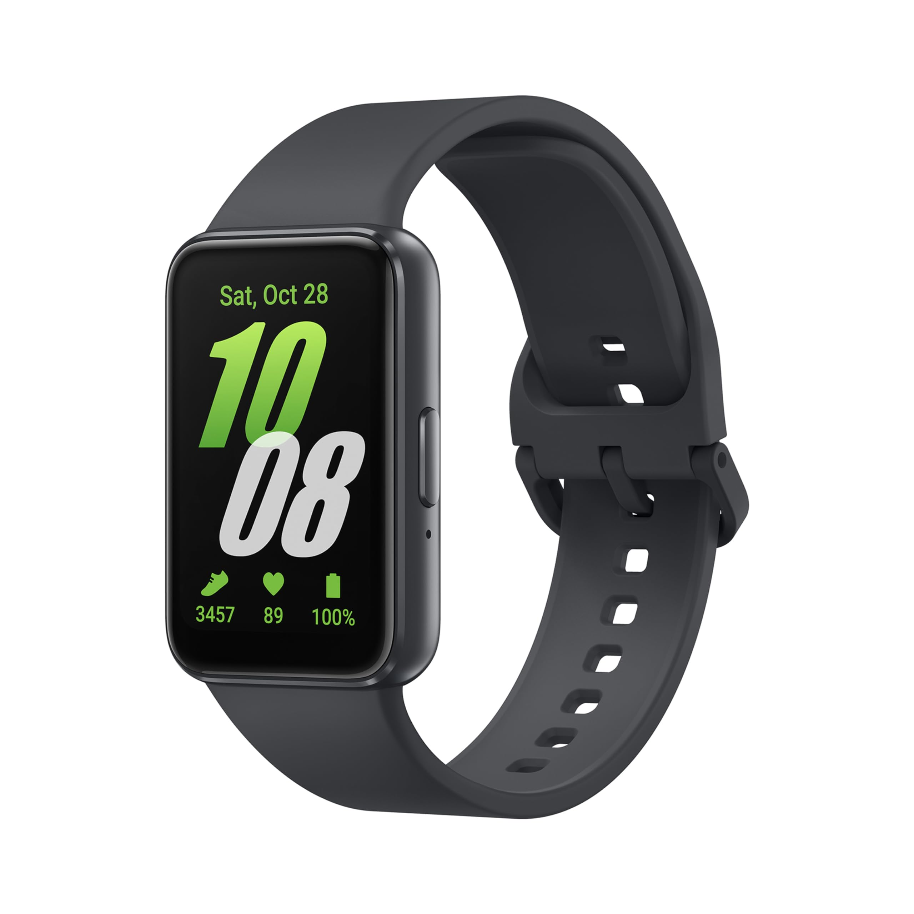

# OPPO/Samsung Galaxy Fit3 Watchface Parser



A reverse-engineered parser and renderer for OPPO-format watchface binaries used by the **Samsung Galaxy Fit3** (SM-R390). Parses the proprietary `.bin` format, extracts embedded images, and reconstructs full watchface previews with customizable demo data.

## Table of Contents

- [Features](#features)
- [Requirements](#requirements)
- [Obtaining Watchface Files](#obtaining-watchface-files)
- [Usage](#usage)
  - [Basic Commands](#basic-commands)
  - [Preview Rendering](#preview-rendering)
  - [Customizing Demo Values](#customizing-demo-values)
  - [World Clock](#world-clock)
  - [Full CLI Reference](#full-cli-reference)
- [FIT3.studio](#fit3studio)
- [Output](#output)
- [Legal Disclaimer](#legal-disclaimer)

---

## Features

- Parses the OPPO binary watchface container format (`.bin`)
- Extracts all embedded images (RGB565 / RGB565+Alpha) to PNG
- Reconstructs full watchface previews
- Supports all known widget types: Static, Hand (analog), Sprite, Pair (text), Badge (progress bar), Comp (composite text), Arc (circular gauge), LineBar
- Multi-style and AOD (Always-On Display) rendering
- Font binding and glyph group parsing with locale support
- World clock rendering support
- Generates contact sheets of all styles in a watchface
- Includes `FIT3.studio` — a browser-based visual watchface inspector

---

## Requirements

- **Python 3.6+**
- **Pillow** (for image rendering): `pip install pillow`

---

## Obtaining Watchface Files

Watchface `.bin` files are embedded inside APK files distributed by the Samsung Fit3 plugin. There are two ways to obtain them:

### Method 1: Extract from APK (offline)

If you have the Fit3 plugin APK (e.g. from an APK mirror site or extracted from your device), the watchface binaries are located at:

```
com.samsung.wearable.fit3/assets/watchface/SM_R390/<watchface_name>/<watchface_name>.bin
```

Simply unzip the APK and navigate to that path.

### Method 2: Pull via ADB (after uploading a face)

If your phone is connected via ADB and you've uploaded a watchface through the Fit3 app, you can dynamically pull the temporary APK:

```bash
adb pull "/sdcard/Android/data/com.samsung.wearable.fit3plugin/files/Download/temp_watchface/SM-*.apk"
```

Then unzip the pulled APK and extract the `.bin` files from the `assets/watchface/` directory inside it.

> **Note**: The parser also supports auto-resolving filenames from `watchfaces-bins/`, `watchface-bins/`, or `APK/com.samsung.wearable.fit3/assets/watchface/SM_R390/` relative directories — so you can just pass the watchface name without the full path if you organize your files accordingly.

---

## Usage

### Basic Commands

**Show watchface info** (default when no action flag is given):
```bash
python parser.py watchface.bin
```

**Show info explicitly:**
```bash
python parser.py watchface.bin --info
```

**Reconstruct watchface preview images:**
```bash
python parser.py watchface.bin --reconstruct
```

**Extract all embedded images to PNG:**
```bash
python parser.py watchface.bin --extract-images
```

**Reconstruct a specific style only:**
```bash
python parser.py watchface.bin --reconstruct --style 0
```

**Specify a custom output directory:**
```bash
python parser.py watchface.bin --reconstruct --output ./my_output
```

### Preview Rendering

When using `--reconstruct`, the parser renders the watchface with demo data. You can customize every value shown on the watch face:

**Set the time:**
```bash
python parser.py watchface.bin --reconstruct --time 14:30 --second 45
```

**Set the date:**
```bash
python parser.py watchface.bin --reconstruct --date 25 --month 6 --weekday 2 --year 2026
```

### Customizing Demo Values

All health, fitness, and environment metrics can be overridden:

```bash
python parser.py watchface.bin --reconstruct \
  --steps 8500 --step-goal 10000 \
  --bpm 72 \
  --battery 65 \
  --temp 18 --temp-min -5 --temp-max 35 \
  --kcal 420 --kcal-goal 600 \
  --activity 55 --activity-goal 60 \
  --active-hours 5 --active-hours-goal 8 \
  --floors 7 \
  --sleep 8.5 --sleep-goal 9.0 \
  --water 1500 --water-goal 2000
```

### World Clock

Watchfaces with a world clock widget can be customized:

```bash
python parser.py watchface.bin --reconstruct \
  --world-time 09:15 \
  --world-date 25 \
  --world-month 6 \
  --world-weekday 2 \
  --world-year 2026 \
  --world-name "Tokyo"
```

### Full CLI Reference

```
usage: parser.py [-h] [--reconstruct] [--extract-images] [--info]
                 [--style STYLE] [--output OUTPUT] [--time TIME]
                 [--date DATE] [--month MONTH] [--weekday WEEKDAY]
                 [--second SECOND] [--steps STEPS] [--step-goal STEP_GOAL]
                 [--bpm BPM] [--battery BATTERY] [--temp TEMP]
                 [--temp-min TEMP_MIN] [--temp-max TEMP_MAX] [--kcal KCAL]
                 [--kcal-goal KCAL_GOAL] [--activity ACTIVITY]
                 [--activity-goal ACTIVITY_GOAL]
                 [--active-hours ACTIVE_HOURS]
                 [--active-hours-goal ACTIVE_HOURS_GOAL] [--floors FLOORS]
                 [--sleep SLEEP] [--sleep-goal SLEEP_GOAL] [--water WATER]
                 [--water-goal WATER_GOAL] [--year YEAR]
                 [--world-time WORLD_TIME] [--world-date WORLD_DATE]
                 [--world-month WORLD_MONTH] [--world-weekday WORLD_WEEKDAY]
                 [--world-year WORLD_YEAR] [--world-name WORLD_NAME]
                 binfile
```

| Argument | Type | Default | Description |
|---|---|---|---|
| `binfile` | positional | *(required)* | Path to the watchface `.bin` file (or directory/name for auto-resolve) |
| `--reconstruct` | flag | off | Render watchface preview PNG(s) from the binary data |
| `--extract-images` | flag | off | Extract all raw embedded images to PNG files |
| `--info` | flag | auto | Print watchface metadata, widget tree, font bindings, and glyph groups. Shown by default if no other action is specified |
| `--style STYLE` | int | all | Only process a specific style index (0-based) |
| `--output OUTPUT` | str | `<binfile>_out/` | Output directory for extracted/rendered files |
| **Time & Date** ||||
| `--time TIME` | str | `10:08` | Display time in `HH:MM` format |
| `--second SECOND` | int | `30` | Seconds value (0–59) |
| `--date DATE` | int | `28` | Day of the month (1–31) |
| `--month MONTH` | int | `12` | Month number (`1`=Jan .. `12`=Dec) |
| `--weekday WEEKDAY` | int | `5` | Day of the week (`0`=Mon .. `6`=Sun) |
| `--year YEAR` | int | `2023` | Year (e.g. `2026`) |
| **Health & Fitness** ||||
| `--steps STEPS` | int | `3457` | Step count |
| `--step-goal STEP_GOAL` | int | `6000` | Step goal (used for progress indicators) |
| `--bpm BPM` | int | `78` | Heart rate (beats per minute) |
| `--kcal KCAL` | int | `350` | Calories burned |
| `--kcal-goal KCAL_GOAL` | int | `500` | Calorie goal |
| `--activity ACTIVITY` | int | `78` | Activity minutes |
| `--activity-goal ACTIVITY_GOAL` | int | `90` | Activity goal |
| `--active-hours ACTIVE_HOURS` | int | `3` | Active hours count |
| `--active-hours-goal ACTIVE_HOURS_GOAL` | int | `8` | Active hours goal |
| `--floors FLOORS` | int | `3` | Floors climbed |
| `--sleep SLEEP` | float | `7.833` | Hours of sleep (decimal, e.g. `7.5` = 7h 30m) |
| `--sleep-goal SLEEP_GOAL` | float | `10.0` | Sleep goal in hours |
| `--water WATER` | int | `250` | Water intake (ml) |
| `--water-goal WATER_GOAL` | int | `2000` | Water intake goal (ml) |
| **Environment** ||||
| `--battery BATTERY` | int | `100` | Battery percentage (0–100) |
| `--temp TEMP` | int | `23` | Current temperature (°C) |
| `--temp-min TEMP_MIN` | int | `-20` | Min temperature (for progress gauge range) |
| `--temp-max TEMP_MAX` | int | `45` | Max temperature (for progress gauge range) |
| **World Clock** ||||
| `--world-time WORLD_TIME` | str | *(none)* | World clock time in `HH:MM` format |
| `--world-date WORLD_DATE` | int | *(none)* | World clock day of month |
| `--world-month WORLD_MONTH` | int | *(none)* | World clock month (`1`=Jan .. `12`=Dec) |
| `--world-weekday WORLD_WEEKDAY` | int | *(none)* | World clock weekday (`0`=Mon .. `6`=Sun) |
| `--world-year WORLD_YEAR` | int | *(none)* | World clock year |
| `--world-name WORLD_NAME` | str | *(none)* | World clock city label (e.g. `"Tokyo"`, `"London"`) |

---

## FIT3.studio

The project includes `FIT3_studio.html`, a standalone browser-based visual inspector for watchface binaries. Open it directly in any modern browser — no server required.

---

## Output

When running `--reconstruct`, the parser generates:
- `style0.png`, `style1.png`, etc. — individual watchface style previews at 256×402 (native Fit3 resolution)
- `aod.png` — Always-On Display rendering (if the watchface includes an AOD style)
- `_all_styles.png` — contact sheet of all styles side by side

When running `--extract-images`, the parser extracts:
- `preview.png` — the watchface preview thumbnail
- `style<N>/img_<offset>_<WxH>.png` — every embedded image asset per style

When running `--info`, the parser prints:
- Watchface ID, version, and filename
- Font bindings (name, point size, family)
- Glyph groups (locale-aware string tables)
- Full widget tree per style (type, position, size, seq binding, colors, frame counts, etc.)

---

## Note

⚠️ **AI-assisted development**: This parser was developed with the assistance of AI tools (Claude code and some OpenCode).
🔬 **Alpha quality**: The parser is still in early development and may contain bugs.
🔧 **Hardcoded elements**: Some values are currently hardcoded and may not work for all watchface variants and a lot of the watchfaces features are guessed because I am not the best type of developer.

---

## Legal Disclaimer

**This project is the result of independent reverse engineering for interoperability and research purposes.**

- **No copyrighted material is distributed.** This repository contains only original code that parses and interprets the binary format. No Samsung/OPPO watchface files, assets, images, or proprietary data are included.
- **Reverse engineering for interoperability is protected** under laws such as the EU Directive 2009/24/EC (Article 6), the US DMCA §1201(f), and similar provisions in many jurisdictions. This project exists to enable users to inspect and preview watchface files on their own devices.
- **No Terms of Service agreement.** The author of this project has not used, installed, or agreed to the Terms of Service of any Samsung application (Galaxy Wearable, Fit3 plugin, Galaxy Store, etc.). The Samsung TOS and EULA cannot bind parties who have never agreed to them. The watch is used exclusively offline, independently of any Samsung software or services.
- **No affiliation.** This project is not affiliated with, endorsed by, or connected to Samsung Electronics, or any of their subsidiaries. "Samsung Galaxy Fit3" and "OPPO" are trademarks of their respective owners, used here solely for identification purposes.
- **Personal use.** This tool is intended for personal, non-commercial use — inspecting watchface files that you already own or have access to on your own device.
